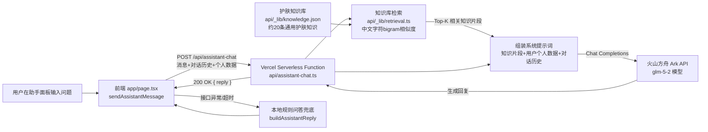

# LUMIÈRE｜你的光泽日程 —— 产品需求文档（PRD）

## 文档信息

| 项目 | 内容 |
| --- | --- |
| 产品名称 | LUMIÈRE（你的光泽日程） |
| 文档版本 | v1.1 |
| 产品形态 | Web 应用（响应式，桌面 + 移动浏览器） |
| 目标平台 | 现代浏览器，数据本地存储（localStorage） |
| 技术栈 | React 19 + Next.js 16 + TypeScript，Vite/Vinext 构建，可选 Cloudflare Workers / D1；智能助手后端为 Vercel Serverless Function + 火山方舟（Volcengine Ark）大模型 API |

---

## 1. 背景与问题

许多用户拥有多件美妆护肤产品，但在日常使用中普遍面临以下问题：

1. **选择困难**：产品多、成分和适用肤质不同，早晚该用哪几件不清晰。
2. **状态与产品脱节**：皮肤当天的状态（偏干、偏油、起痘、泛红等）会变化，但护理方案通常是固定不变的。
3. **时间不确定**：有时赶时间只想做最基础的步骤，有时时间充裕想做完整护理，缺少弹性方案。
4. **行程影响护理**：出门、运动、开会、旅行等不同场景对防晒、清洁、保湿的需求不同，但用户很少会针对行程主动调整护理内容。
5. **产品生命周期难管理**：开封日期、有效期、库存消耗情况容易被忽略，导致过期使用或者临时缺货。
6. **缺乏持续记录**：护理是否坚持、当天感受如何，往往没有留痕，难以复盘长期皮肤状态变化。

## 2. 产品目标

打造一个将 **“产品库 — 护理方案 — 每日状态 — 日程行程 — 使用记录”** 串联起来的个人美妆日程管理工具，让用户：

- 用最少的操作，每天获得贴合当前状态、时间和行程的护理建议；
- 清楚知道产品为什么被推荐或排除（可解释，而非黑盒）；
- 通过日历持续记录护理与行程，形成可回顾的历史数据；
- 数据完全保存在本地浏览器，无需注册、无隐私上传顾虑。

### 非目标（Out of Scope，当前版本）

- 不做真实的成分分析或医学皮肤诊断建议（RAG 检索到的护肤知识仅作科普参考，非医学结论）；
- 不接入电商购买链路；
- 不做多设备账号同步（当前为单浏览器本地存储，云端能力预留但未启用）；
- 不做真正的向量嵌入检索，知识库检索采用轻量级中文字符 bigram 相似度算法（详见 6.2 节），适合当前规模较小的自建知识库，暂不引入向量数据库。

## 3. 目标用户与场景

### 目标用户

- 拥有一定数量护肤/美妆产品、希望规范化护理流程的用户；
- 皮肤状态波动较大（如换季、压力、作息影响），需要灵活调整护理方案的用户；
- 日程较满、需要根据场景快速决定护理内容的用户（通勤族、职场人群、经常出行者）。

### 核心使用场景

1. 早上起床，用户在“今天”页面选择当前肤感和可用时间，系统给出一套护理步骤，完成后打卡。
2. 用户当天有户外活动或运动安排，在“行程”中登记后，系统在“今天”页自动给出匹配该行程的产品建议（如防晒、清洁）。
3. 用户新入手一件产品，在“梳妆台”中录入品牌、类别、开封日期、有效期、适用/避用肤质标签。
4. 用户在“方案”页调整早晚护理的固定步骤顺序、启用/禁用某天的方案。
5. 用户想快速了解“今天有什么安排”“该用什么产品”，可以直接用文字或语音向助手提问。
6. 用户在月度日历中回顾过去的护理完成情况、行程记录与整体小结。

## 4. 功能需求

### 4.1 今日护理（Today）

| 功能点 | 描述 |
| --- | --- |
| 早/晚切换 | 用户可切换“早间/晚间”护理时段，对应不同方案 |
| 时间节奏选择 | 极速（约2分钟）/ 日常（约5分钟）/ 完整（10分钟+）三档，影响推荐步骤数量与内容 |
| 肤质状态选择 | 正常、偏干、偏油、起痘较多、泛红或刺痛、状态不确定，六种状态之一 |
| 智能护理步骤推荐 | 基于当前方案、肤质标签、避用标签、启用状态、时间节奏动态生成护理步骤列表 |
| 推荐理由说明 | 每次推荐附带文字说明，解释为何选择或替换某些产品 |
| 完成度进度环 | 按已勾选完成的步骤数 / 推荐步骤总数计算百分比，环形图可视化展示 |
| 步骤打卡 | 逐项勾选完成，可撤销 |
| 记录本次护理 | 完成打卡后可填写"当天感受"文字备注并保存为使用记录 |
| 跳过本次 | 一键记录"本次跳过"，不顺延到次日 |
| 延后提醒 | 提供"延后30分钟"的即时反馈（轻量提醒，非系统级推送） |
| 行程护理建议 | 展示当天所有行程，并按行程类型（通勤/会议/户外/运动/约会/旅行/居家/聚会）匹配合适产品与推荐理由 |

### 4.2 梳妆台（我的产品库）

| 功能点 | 描述 |
| --- | --- |
| 产品统计概览 | 使用中数量、本月使用次数、快用完数量、需要留意（临期或暂停）数量 |
| 分类筛选 | 按洁面、精华、乳霜、防晒、面膜、彩妆、工具等分类查看 |
| 新增/编辑产品 | 录入名称、品牌、类别、颜色标识、开封日期、有效期（月）、状态（未开封/使用中/暂停使用/已空瓶）、库存（充足/约一半/快用完）、适用肤质标签、避用肤质标签、是否为必要步骤、是否可用于极速方案、备注 |
| 图片上传与压缩 | 支持上传产品图片，前端自动等比缩放并压缩为 WebP 格式后存储，控制本地存储体积 |
| 有效期提醒 | 根据开封日期与有效期月数计算剩余天数，临期（<60天）或已过期会在产品卡片上高亮提示 |
| 删除产品 | 删除时二次确认，并自动从所有护理方案中移除该产品的引用，保持数据一致性 |

### 4.3 护理方案（Routines）

| 功能点 | 描述 |
| --- | --- |
| 早晚双方案 | 分别维护晨间与晚间的基础护理方案 |
| 启用/禁用 | 方案可整体启用或禁用，禁用后不参与当日推荐与日历标记 |
| 重复日期设置 | 按星期一到星期日设置该方案生效的日期 |
| 提醒时间 | 可设置该方案对应的提醒时间点 |
| 步骤增删排序 | 从梳妆台"使用中"产品中选择加入步骤，可移除已加入的步骤 |
| 历史记录隔离 | 修改方案只影响未来安排，已产生的历史使用记录保留当时的产品快照 |

### 4.4 日历（Calendar）

| 功能点 | 描述 |
| --- | --- |
| 月历视图 | 展示整月日期，标记当日行程（最多显示2条，超出显示"还有N项"） |
| 状态标记 | 每日标记：已安排（方案生效日）、已完成（有完成记录）、已跳过（有跳过记录） |
| 日期详情面板 | 选中某天后展示当天行程列表、护理记录、可直接添加/编辑行程 |
| 行程管理 | 新增、编辑、删除行程，字段包括标题、日期、开始/结束时间、类型、地点、备注 |
| 月度小结 | 汇总当月行程数、完成护理次数、使用产品总次数、最近一次记录的感受 |

### 4.5 智能助手（Assistant）

| 功能点 | 描述 |
| --- | --- |
| 文字对话 | 输入框发送消息，助手结合护肤知识库和用户个人数据，调用大模型生成回复（RAG，检索增强生成） |
| RAG 知识库检索 | 内置约20条护肤通用知识条目（成分、防晒、产品保质期、护理误区等），按用户问题做中文文本相似度检索，取相关度最高的条目注入大模型提示词 |
| 个人数据接入 | 每次对话自动附带用户当前肤感、护理节奏、今日行程、梳妆台产品（含状态/库存/标签/临期天数）等真实数据，让回复贴合个人情况且不虚构数据 |
| 语音输入 | 调用浏览器 SpeechRecognition API，将语音转文字后自动发送 |
| 语音播报 | 可选开启后，助手回复通过 SpeechSynthesis 朗读（中文） |
| 快捷操作 | 识别"添加行程"类意图时直接打开行程添加表单（本地规则处理，无需调用大模型，响应更快） |
| 规则兜底 | 大模型接口不可用、超时或返回异常时，自动降级为原有的关键词规则问答，保证助手始终可用 |
| 安全与免责 | 系统提示词要求模型不编造用户没有的产品/行程、不给出具体医学诊断，皮肤问题较严重时建议咨询专业医生 |

### 4.6 数据持久化

| 功能点 | 描述 |
| --- | --- |
| 本地存储 | 所有产品、方案、使用记录、行程数据保存在浏览器 localStorage |
| 容错恢复 | 读取本地数据失败时自动回退到示例数据，并提示用户 |
| 自动保存 | 数据变更后自动写入本地存储，无需手动保存操作 |

## 5. 信息架构与数据模型

### 核心实体

- **Product（产品）**：id、名称、品牌、类别、图片、颜色标识、开封日期、有效期月数、状态、库存、适用肤质标签、避用肤质标签、是否必要、是否极速可用、使用次数、最近使用日期、备注
- **Routine（护理方案）**：id、名称、时段（早/晚）、提醒时间、生效星期、产品步骤列表、启用状态
- **UsageLog（使用记录）**：id、日期、时段、方案名称、产品列表、感受备注、状态（完成/跳过）
- **Itinerary（行程）**：id、标题、日期、开始/结束时间、类型、地点、备注
- **KnowledgeChunk（知识条目，后端）**：id、标题、标签、正文内容，维护在 `api/_lib/knowledge.json`，不出现在前端本地存储中

### 导航结构

```
LUMIÈRE
├── 今天（Today）— 默认首页
├── 日历（Calendar）
├── 梳妆台（Products）
└── 方案（Routines）
（悬浮）智能助手入口
```

## 6. 推荐逻辑规则与智能助手 RAG 架构

### 6.1 护理推荐算法（核心算法说明）

1. 从当前时段（早/晚）对应的启用方案中取出步骤产品；
2. 过滤掉已停用或命中当前肤质"避用标签"的产品；
3. 若同类别中存在更匹配当前肤质标签的产品，则替换为更优匹配项；
4. 按时间节奏裁剪结果：
   - 极速：仅保留标记为"极速可用"的步骤，最多3项；
   - 日常：保留所有"必要步骤" + 1项匹配当前肤质的非必要步骤，最多4项，按原方案顺序排列；
   - 完整：保留全部匹配结果；
5. 生成自然语言推荐理由，说明匹配依据或风险提示（如肤质不确定/泛红时优先基础产品）。

行程护理建议采用类似逻辑，按行程类型预设类别优先级（如"户外"优先防晒、乳霜、洁面），从匹配肤质的产品中各类别取一项，最多3项。

### 6.2 智能助手 RAG（检索增强生成）架构



**检索层（Retrieval）**：知识库以 JSON 形式维护在后端 `api/_lib/knowledge.json`（不下发到前端，不占用 localStorage），每条包含标题、标签、正文。由于中文没有天然的单词分隔符，检索没有引入向量嵌入或额外的 Embedding API 依赖，而是采用轻量级的字符级 bigram（二元组）集合做 Jaccard 类相似度打分，取相关度最高且超过阈值的最多3条知识片段，兼顾了小规模知识库场景下的效果与实现成本、零额外服务依赖。

**增强层（Augmentation）**：每次请求会将以下内容组装进系统提示词：
- 检索到的知识片段（护肤通用知识）；
- 用户当前的真实数据：肤感、护理节奏、时段、今天的行程列表、梳妆台产品（名称/品牌/分类/状态/库存/标签/避用标签/临期天数，最多20件）；
- 最近6轮对话历史，保证多轮对话的上下文连贯性。

**生成层（Generation）**：调用火山方舟（Volcengine Ark）的 OpenAI 兼容 Chat Completions 接口（`glm-5-2` 系列模型），系统提示词中明确要求模型：只引用用户真实数据、不编造成分功效或医学结论、皮肤问题严重时建议咨询专业医生、保持轻奢温暖的语气。

**兜底与降级**：
- 请求"添加行程"类意图时，前端直接本地打开行程表单并返回固定文案，不经过大模型，响应更快；
- 若调用大模型接口失败、超时（本地设置45秒超时）或返回为空，前端自动降级为原有的关键词规则问答（`buildAssistantReply`），保证助手在没有网络/接口异常时依然可用；
- 该能力依赖 Vercel Serverless Function，仅在 Vercel 部署环境生效；纯静态的 GitHub Pages 部署没有对应的后端接口，请求会失败并自动降级为规则问答。

**环境变量**：`ARK_API_KEY`（必填，密钥）、`ARK_BASE_URL`（默认 `https://ark.cn-beijing.volces.com/api/v3`）、`ARK_MODEL`（默认 `glm-5-2-260617`），均通过 Vercel 项目环境变量注入，不写入代码仓库。

## 7. 非功能需求

| 类别 | 要求 |
| --- | --- |
| 性能 | 首屏渲染快速，推荐计算在客户端通过 useMemo 缓存，避免重复计算 |
| 隐私 | 无账号体系，数据不上传服务器，用户可随时清除浏览器数据即完成"注销" |
| 可访问性 | 关键交互元素提供 aria-label，弹窗支持 Escape 关闭，状态图标配合文字说明 |
| 兼容性 | 语音输入/播报为渐进增强功能，浏览器不支持时优雅降级为文字交互提示；智能助手大模型接口不可用时自动降级为规则问答 |
| 可维护性 | TypeScript 强类型约束核心数据模型，避免状态不一致 |
| 视觉风格 | 轻奢极简风格，米杏底色 + 金棕/玫瑰/鼠尾草点缀色，衬线+无衬线字体搭配 |
| 响应时延 | 大模型为推理模型，单次回复通常需要10~30秒，前端展示"正在思考"打字动效并禁用重复发送，后端设置45秒超时、Vercel 函数 `maxDuration` 设为60秒 |
| 密钥安全 | 大模型 API Key 仅存储在 Vercel 项目环境变量中，不写入代码仓库；本地开发通过 `.env.local`（已加入 .gitignore）读取 |

## 8. 版本规划建议

### V1（当前已实现）
产品库管理、双时段护理方案、场景化推荐引擎、行程日历、使用打卡记录、本地数据持久化；智能助手支持基于 RAG（护肤知识库检索 + 用户个人数据 + 大模型生成）的自然语言问答，并保留规则型问答作为降级兜底。

### V2（建议方向）
- 云端账号与多端同步（已预留 Cloudflare D1 + Drizzle ORM 基础设施）；
- 护理效果趋势分析（如肤感变化曲线、产品复购/弃用统计）；
- 到期与库存不足的主动提醒（浏览器通知或邮件）；
- 知识库检索升级为向量嵌入（Embedding）+ 向量数据库，支持更大规模、更精细的语义检索；
- 助手支持多轮对话的持久化记忆（当前对话历史仅保存在当次会话内存中，刷新页面后清空）；
- 方案模板市场或社区分享（如"敏感肌晨间方案"模板）。

## 9. 风险与约束

- **数据丢失风险**：纯本地存储意味着清除浏览器缓存或更换设备将丢失全部数据，需要在 V2 提供导出/导入或云同步能力兜底。
- **推荐非医学建议**：产品需在界面中明确定位为"基于用户自定义标签的辅助建议"，避免用户将其等同于专业皮肤科诊断；智能助手的系统提示词同样要求不给出医学诊断结论。
- **语音功能兼容性**：依赖浏览器 Web Speech API，部分浏览器（如部分 Firefox 版本）不支持，需保证文字交互始终可用。
- **大模型接口依赖**：智能助手的 RAG 问答依赖第三方大模型 API（火山方舟）的可用性、时延与调用成本；接口异常时已自动降级为规则问答，但功能丰富度会下降。
- **部署环境差异**：RAG 问答依赖 Vercel Serverless Function，仅在 Vercel 部署下可用；GitHub Pages 为纯静态托管，该场景下助手会自动使用规则问答。
- **知识库检索精度有限**：字符 bigram 相似度是轻量级近似方案，对表述差异较大的提问召回效果不如向量语义检索，属于当前规模下的合理取舍。

---

*本 PRD 基于现有代码实现（`app/page.tsx`、`api/assistant-chat.ts`、`api/_lib/`、`db/schema.ts`、`README.md` 等）梳理归纳，可作为项目复盘、需求评审或功能迭代规划的基础文档。*
